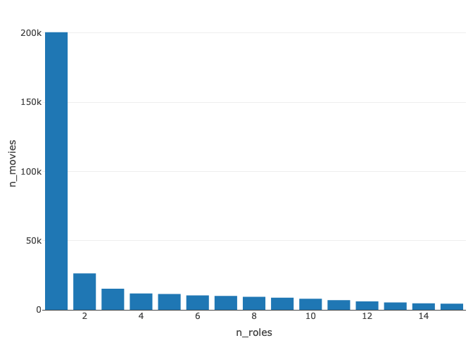

Lab 3
================
Pedro Vargas
2024-09-02

``` r
knitr::opts_chunk$set(webshot = TRUE)
library(tidyverse)
```

    ## ── Attaching core tidyverse packages ──────────────────────── tidyverse 2.0.0 ──
    ## ✔ dplyr     1.1.4     ✔ readr     2.1.5
    ## ✔ forcats   1.0.0     ✔ stringr   1.5.1
    ## ✔ ggplot2   3.5.1     ✔ tibble    3.2.1
    ## ✔ lubridate 1.9.3     ✔ tidyr     1.3.1
    ## ✔ purrr     1.0.2     
    ## ── Conflicts ────────────────────────────────────────── tidyverse_conflicts() ──
    ## ✖ dplyr::filter() masks stats::filter()
    ## ✖ dplyr::lag()    masks stats::lag()
    ## ℹ Use the conflicted package (<http://conflicted.r-lib.org/>) to force all conflicts to become errors

``` r
##install.packages("plotly")
library(plotly)
```

    ## 
    ## Attaching package: 'plotly'
    ## 
    ## The following object is masked from 'package:ggplot2':
    ## 
    ##     last_plot
    ## 
    ## The following object is masked from 'package:stats':
    ## 
    ##     filter
    ## 
    ## The following object is masked from 'package:graphics':
    ## 
    ##     layout

``` r
library(dplyr)
##install.packages("webshot2")

actors <- read.csv("actors.csv")
directorsg <- read.csv("directors_genres.csv")
directors <- read.csv("directors.csv")
moviesd <- read.csv("movies_directors.csv")
moviesg <- read.csv("movies_genres.csv")
movies <- read.csv("movies.csv")
roles <- read.csv("roles.csv")


## PROBLEMA 1 Numeró de películas y de directores

num_movie <- movies %>%
                summarise(num_movies = n_distinct(id))
print("¿Cuál es el número de películas?")
```

    ## [1] "¿Cuál es el número de películas?"

``` r
print(num_movie)
```

    ##   num_movies
    ## 1     388269

``` r
num_director <- directors %>%
                summarise(num_directors = n_distinct(id))

print("¿Cuál es el número de directores?")
```

    ## [1] "¿Cuál es el número de directores?"

``` r
print(num_director)
```

    ##   num_directors
    ## 1         86880

``` r
##PROBLEMA 2 Número promedio de generos por director

genres_director <- directorsg %>%
  group_by(director_id) %>%
  summarise(num_genres = n_distinct(genre)) %>%
  ungroup()%>%
  summarise(general_average = mean(num_genres, na.rm = TRUE))

print("¿Cuál es el número promedio de géneros por director?")
```

    ## [1] "¿Cuál es el número promedio de géneros por director?"

``` r
print(genres_director)
```

    ## # A tibble: 1 × 1
    ##   general_average
    ##             <dbl>
    ## 1            2.41

``` r
##PROBLEMA 3 Reporte para los roles

num_movie_for_role <- roles %>%
                group_by(role)%>%
                summarise(num_movies = n_distinct(movie_id)) 

num_actors_for_role <- roles %>%
                       left_join(actors, by = c("actor_id"="id")) %>%
                       group_by(role) %>%
                       summarise(num_actors = sum(gender=="M",na.rm = TRUE))

num_actress_for_role <- roles %>%
                         left_join(actors, by = c("actor_id"="id")) %>%
                         group_by(role) %>%
                         summarise(num_actress = sum(gender=="F",na.rm = TRUE))

num_directores_for_role <- roles %>%
                          left_join(movies, by = c("movie_id"="id")) %>%
                         left_join(moviesd, by = "movie_id")%>%
                         group_by(role) %>%
                         summarise(num_directores = n())
```

    ## Warning in left_join(., moviesd, by = "movie_id"): Detected an unexpected many-to-many relationship between `x` and `y`.
    ## ℹ Row 2 of `x` matches multiple rows in `y`.
    ## ℹ Row 303391 of `y` matches multiple rows in `x`.
    ## ℹ If a many-to-many relationship is expected, set `relationship =
    ##   "many-to-many"` to silence this warning.

``` r
role_report <- num_movie_for_role %>%
              left_join(num_actors_for_role, by = "role") %>%
              left_join(num_actress_for_role, by = "role") %>%
              left_join(num_directores_for_role, by = "role")%>%
              arrange((desc(num_movies)))

print("Reporte sobre los roles")
```

    ## [1] "Reporte sobre los roles"

``` r
head(role_report, 10)
```

    ## # A tibble: 10 × 5
    ##    role        num_movies num_actors num_actress num_directores
    ##    <chr>            <int>      <int>       <int>          <int>
    ##  1 ""              164782     595783      325206        1011668
    ##  2 "Himself"        20187      86425         105         102007
    ##  3 "Herself"        11802         93       34833          39755
    ##  4 "Narrator"        7875       7227        1229          10754
    ##  5 "Host"            4751       4304        1589           6950
    ##  6 "Doctor"          3891       3823         306           4480
    ##  7 "Policeman"       3126       4527          10           4891
    ##  8 "Nurse"           3076         99        3633           4028
    ##  9 "Bartender"       3042       2983         202           3353
    ## 10 "Reporter"        2615       3959        1031           5416

``` r
##PROBLEMA 4 Reporte sobre los directores

num_movie_for_director <- directors %>%
                          left_join(moviesd, by = c("id"="director_id")) %>%
                          group_by(id)%>%
                          summarise(num_movies = n())

num_actors_for_director <- moviesd %>%
                          left_join(movies, by =c("movie_id"="id")) %>%
                          left_join(roles, by ="movie_id") %>%
                          group_by(director_id) %>%
                          summarise(num_actors = n_distinct(director_id,actor_id))
```

    ## Warning in left_join(., roles, by = "movie_id"): Detected an unexpected many-to-many relationship between `x` and `y`.
    ## ℹ Row 2 of `x` matches multiple rows in `y`.
    ## ℹ Row 119372 of `y` matches multiple rows in `x`.
    ## ℹ If a many-to-many relationship is expected, set `relationship =
    ##   "many-to-many"` to silence this warning.

``` r
director_common_genre <- directorsg %>%
                        filter(prob == max(prob,na.rm = TRUE)) %>%
                        group_by(director_id)%>%
                        summarise(common_genre=paste0(genre,collapse = " "))

directors_information <- directors %>%
                        left_join(num_movie_for_director, by = "id") %>%
                        left_join(num_actors_for_director, by = c("id"="director_id")) %>%
                        left_join(director_common_genre, by = c("id"="director_id")) %>%
                        arrange(desc(common_genre))

print("Reporte sobre los directores")
```

    ## [1] "Reporte sobre los directores"

``` r
head(directors_information, 10)
```

    ##      id   first_name last_name num_movies num_actors common_genre
    ## 1    72  Charles (I)    Abbott          2         30      Western
    ## 2   443           W.    Adcook          4         12      Western
    ## 3  1232       Sidney    Algier          1         19      Western
    ## 4  1324    Fred (II)     Allen          7         80      Western
    ## 5  2164        Malon    Andrus          1          9      Western
    ## 6  2673        Edwin     Arden          1          5      Western
    ## 7  3456         Alan     Autry          1         13      Western
    ## 8  4027    Frederick      Bain          2          9      Western
    ## 9  4187 José Antonio   Balanos          1          5      Western
    ## 10 5001    Don 'Red'     Barry          1         17      Western

``` r
## Problema 5 Distribución de roles por película y por director

dist_role_movie <- movies %>% 
  left_join(roles, by = c("id" = "movie_id")) %>%
  group_by(id) %>%
  summarise(n_roles = n_distinct(role)) %>% 
  ungroup() %>%
  group_by(n_roles) %>%
  summarise(n_movies = n()) %>% 
  arrange(n_roles)


dist_role_movie %>% 
  mutate(
    ratio_pct = round(100.0*n_movies/sum(n_movies),1),
    ratio_cumulative = cumsum(ratio_pct)
  ) %>% 
  head(15)
```

    ## # A tibble: 15 × 4
    ##    n_roles n_movies ratio_pct ratio_cumulative
    ##      <int>    <int>     <dbl>            <dbl>
    ##  1       1   200569      51.7             51.7
    ##  2       2    26293       6.8             58.5
    ##  3       3    15283       3.9             62.4
    ##  4       4    11835       3               65.4
    ##  5       5    11508       3               68.4
    ##  6       6    10476       2.7             71.1
    ##  7       7    10043       2.6             73.7
    ##  8       8     9435       2.4             76.1
    ##  9       9     8723       2.2             78.3
    ## 10      10     8044       2.1             80.4
    ## 11      11     6954       1.8             82.2
    ## 12      12     6103       1.6             83.8
    ## 13      13     5380       1.4             85.2
    ## 14      14     4764       1.2             86.4
    ## 15      15     4450       1.1             87.5

``` r
dist_role_movie %>% 
  head(15) %>% 
  plot_ly(x = ~n_roles, y = ~n_movies, type = "bar")
```

<!-- -->

``` r
dist_role_director <- directors %>% 
  rename(director_id = id) %>%
  left_join(moviesd, by = "director_id") %>%
  left_join(movies, by = c("movie_id" = "id")) %>%
  left_join(roles, by = "movie_id")%>%
  group_by(director_id) %>%
  summarise(n_roles = n_distinct(role)) %>% 
  ungroup() %>%
  group_by(n_roles) %>%
  summarise(n_directors = n()) %>% 
  arrange(n_roles)
```

    ## Warning in left_join(., roles, by = "movie_id"): Detected an unexpected many-to-many relationship between `x` and `y`.
    ## ℹ Row 2 of `x` matches multiple rows in `y`.
    ## ℹ Row 119372 of `y` matches multiple rows in `x`.
    ## ℹ If a many-to-many relationship is expected, set `relationship =
    ##   "many-to-many"` to silence this warning.

``` r
dist_role_director %>% 
  mutate(
    ratio_pct = round(100.0*n_directors/sum(n_directors),1),
    ratio_cumulative = cumsum(ratio_pct)
  ) %>% 
  head(15)
```

    ## # A tibble: 15 × 4
    ##    n_roles n_directors ratio_pct ratio_cumulative
    ##      <int>       <int>     <dbl>            <dbl>
    ##  1       1       28334      32.6             32.6
    ##  2       2        7687       8.8             41.4
    ##  3       3        4499       5.2             46.6
    ##  4       4        3316       3.8             50.4
    ##  5       5        2892       3.3             53.7
    ##  6       6        2420       2.8             56.5
    ##  7       7        2006       2.3             58.8
    ##  8       8        1789       2.1             60.9
    ##  9       9        1722       2               62.9
    ## 10      10        1676       1.9             64.8
    ## 11      11        1403       1.6             66.4
    ## 12      12        1270       1.5             67.9
    ## 13      13        1194       1.4             69.3
    ## 14      14        1028       1.2             70.5
    ## 15      15         979       1.1             71.6

``` r
dist_role_director %>% 
  head(15) %>% 
  plot_ly(x = ~n_roles, y = ~n_directors, type = "bar")
```

<!-- -->
